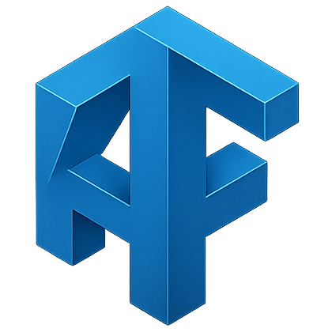

# AxisForge AxisLab



## Overview

AxisForge AxisLab is a modern web application for viewing, simulating, and interacting with robotic models. Built with Next.js and Three.js, it provides a powerful platform for robotics visualization and simulation, supporting both URDF (Unified Robot Description Format) and MJCF (MuJoCo XML Format) models.

## Features

- **Multi-format Robot Viewer**: View and interact with robots in URDF and MJCF formats
- **Interactive 3D Visualization**: Manipulate and explore robot models in 3D space
- **Physics Simulation**: Run physics simulations on MJCF models using MuJoCo
- **Robot Library**: Browse a curated collection of robot models
- **Drag & Drop Support**: Upload your own robot models for viewing
- **Responsive Design**: Works on desktop and mobile devices
- **Performance Optimized**: Lazy loading and code splitting for fast loading times

## Supported Robot Models

The application comes pre-loaded with several robot models:

- **URDF Models**:
  - Anymal B (default)
  - Atlas v4
  - Cassie
  - Dexhand Right
  - Disney BD Robot
  - SO-100

- **MJCF Models**:
  - Cassie Metal
  - Humanoid
  - Unitree H1

## Technology Stack

- **Frontend**: Next.js 15, React 19, TypeScript
- **3D Rendering**: Three.js, @react-three/fiber, @react-three/drei
- **Physics Engine**: MuJoCo (via WebAssembly)
- **Styling**: Tailwind CSS, CSS Variables
- **Deployment**: Render

## Getting Started

### Prerequisites

- Node.js 18.x or later
- npm or yarn

### Installation

1. Clone the repository:
   ```bash
   git clone https://github.com/Zed-CSP/AxisLab.git
   cd axislab
   ```

2. Install dependencies:
   ```bash
   npm install
   ```

3. Run the development server:
   ```bash
   npm run dev
   ```

4. Open [http://localhost:3000](http://localhost:3000) in your browser to see the application.

### Building for Production

```bash
npm run build
npm start
```

## Deployment

The application is configured for deployment on [Render](https://render.com). The `render.yaml` file provides the blueprint for deployment.

## Usage

### Viewing Robot Models

1. Select a robot from the Robot Library panel
2. Use mouse controls to navigate:
   - **Left-click + drag**: Rotate the view
   - **Right-click + drag**: Pan the view
   - **Scroll**: Zoom in/out

### Simulating MJCF Models

1. Select an MJCF model from the Robot Library
2. Click the "Simulate" button to start the physics simulation
3. Observe the model's behavior under simulated physics

### Uploading Custom Models

1. Drag and drop your URDF or MJCF files onto the viewer
2. The application will automatically load and display your model

## Project Structure

- `public/` - Static assets and robot models
  - `urdf/` - URDF model files and meshes
  - `mjcf/` - MJCF model files and meshes
  - `images/` - Application images and icons
- `src/` - Application source code
  - `app/` - Next.js app router components
  - `components/` - React components
  - `contexts/` - React context providers
  - `hooks/` - Custom React hooks
  - `types/` - TypeScript type definitions

## Contributing

Contributions are welcome! Please feel free to submit a Pull Request.

## Future Updates

Planned enhancements for AxisForge AxisLab include:

- **Policy Demonstrations**: Interactive demos of robot control policies
- **Learning Algorithms Visualization**: Visual representation of reinforcement learning algorithms
- **Real-time Policy Training**: Train and test robot policies directly in the browser
- **Policy Transfer**: Export trained policies for use in real robots
- **Collaborative Workspace**: Share and collaborate on robot models and policies

## License

This project is proprietary software.

## Acknowledgements

- Robot models sourced from various open-source repositories
- MuJoCo physics engine for simulation capabilities
- Three.js and React Three Fiber for 3D rendering

---

© Christopher Peret 2025 - AxisForge